[English](README.md) | 简体中文

本项目代码采用 [Apache 2.0](https://www.apache.org/licenses/LICENSE-2.0) 许可

机械设计采用：
[Creative Commons Attribution 4.0 International License][cc-by]。
[![CC BY 4.0][cc-by-image]][cc-by]
[![CC BY 4.0][cc-by-shield]][cc-by]

[cc-by]: http://creativecommons.org/licenses/by/4.0/
[cc-by-image]: https://licensebuttons.net/l/by/4.0/88x31.png
[cc-by-shield]: https://img.shields.io/badge/License-CC%20BY-lightgrey.svg

# Amazing Hand 项目

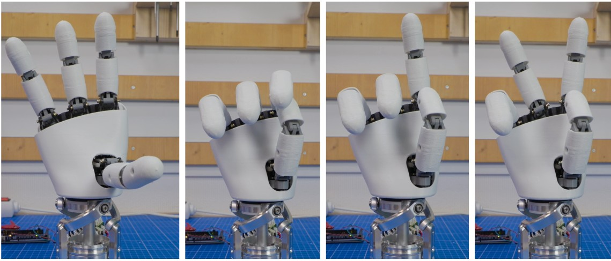

机械手往往价格高昂，表现力却有限。更灵巧的方案通常需要线缆，并把驱动器外移到前臂上，例如……

本项目的目标是：以适中的成本，在真实机器人上探索人形机械手的可能性（Reachy2 是绝佳的载体！）。
=> 腕部接口是按 Reachy2 的腕部（Orbita 3D）设计的，但很容易适配其他机器人的腕部……

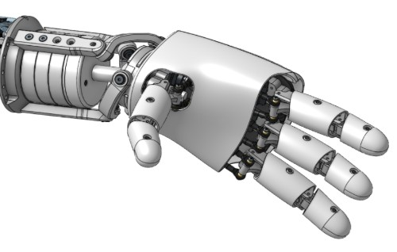

Amazing Hand 的特点：
- 4 根手指、8 自由度的人形机械手
- 每根手指有 2 节指骨，相互铰接
- 几乎全部外壳都是柔性件
- 所有驱动器都在手内，无需任何线缆
- 可 3D 打印
- 重量 400 g
- 低成本（<200€）
- 开源

[AmazingHand_Overview](docs/AmazingHand_Overview.pdf)

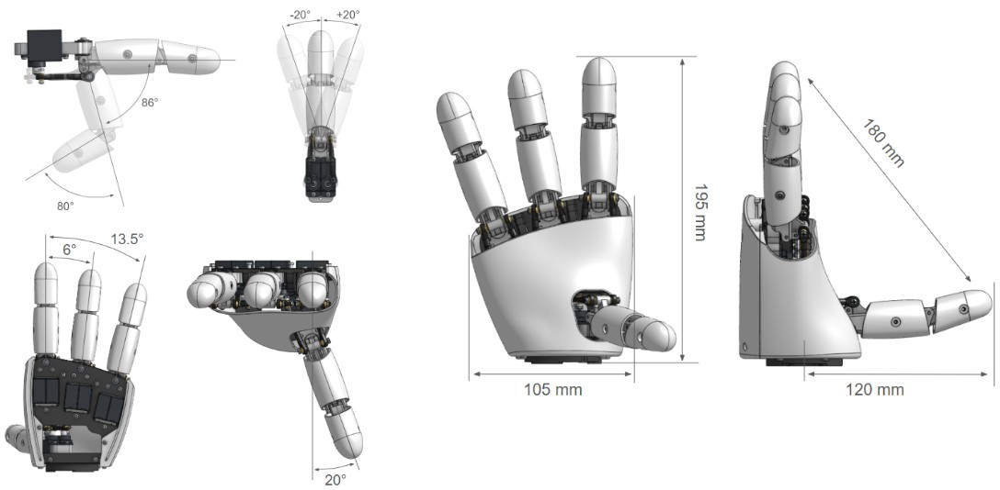
每根手指由一个并联机构驱动。
也就是说，每根手指使用 2 个小型 Feetech SCS0009 舵机，分别实现屈伸（flexion/extension）与收展（abduction/adduction）

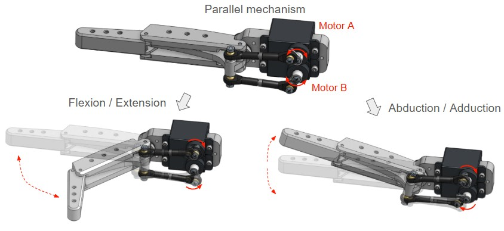

提供两种控制方式：
- 使用串口总线驱动板（如 Waveshare）+ Python 脚本
- 使用 Arduino + Feetech TTL Linker

两种方式都有详细说明，并附带基础演示软件。任你选择！

## 目录

- [构建资料](#构建资料)
    - [BOM（物料清单）](#bom物料清单)
    - [CAD 文件与 Onshape 文档](#cad-文件与-onshape-文档)
    - [组装指南](#组装指南)
    - [运行基础演示](#运行基础演示)
- [免责声明](#免责声明)
- [AmazingHand 进阶演示](#amazinghand-进阶演示)
- [项目动态与社区](#项目动态与社区)
    - [社区贡献](#社区贡献)
    - [待办清单](#待办清单)
    - [常见问题](#常见问题)
    - [联系方式](#联系方式)
    - [致谢](#致谢)

# 构建资料
## BOM（物料清单）
所有所需元器件清单见：
[AmazingHand BOM](https://docs.google.com/spreadsheets/d/1QH2ePseqXjAhkWdS9oBYAcHPrxaxkSRCgM_kOK0m52E/edit?gid=1269903342#gid=1269903342)
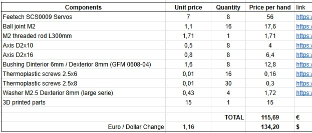

别忘了把控制方案的成本也算进去（前面提到的两种方案）

定制 3D 打印件的详情见：
[3D 打印件](https://docs.google.com/spreadsheets/d/1QH2ePseqXjAhkWdS9oBYAcHPrxaxkSRCgM_kOK0m52E/edit?gid=2050623549#gid=2050623549)

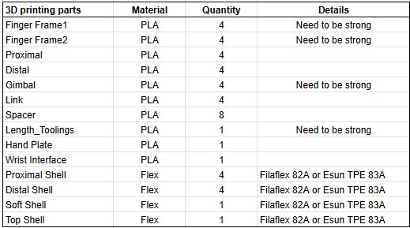

这份指南讲解了如何打印所有需要的定制零件：
[=> 3D 打印指南](docs/AmazingHand_3DprintingTips.pdf)
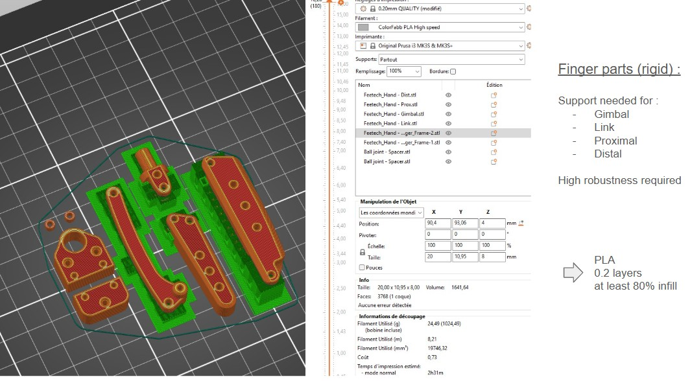

## CAD 文件与 Onshape 文档
STL 和 Step 文件见[这里](https://github.com/pollen-robotics/AmazingHand/tree/main/cad)

注意：如果要组装左手，手指部分是相同的，但有些零件是左右对称件。右手专用零件以 "R" 开头，左手零件以 "L" 开头。

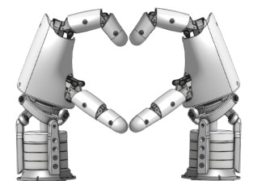

Onshape 文档也向所有人开放：
[Onshape 链接](https://cad.onshape.com/documents/430ff184cf3dd9557aaff2be/w/e3658b7152c139971d22c688/e/bd399bf1860732c6c6a2ee45?renderMode=0&uiState=6867fd3ef773466d059edf0c)

注意 "named position"（命名位置）工具里预置了若干姿态，并配有对应的舵机角度

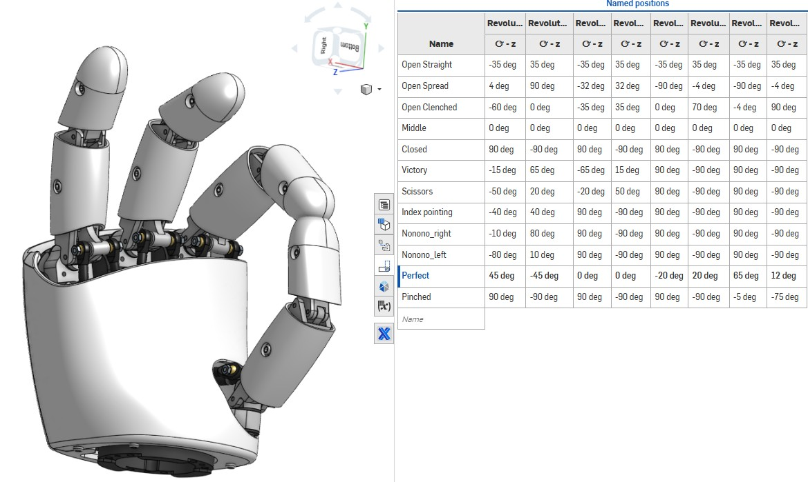

## 组装指南

Amazing Hand 与 BOM 中标准件的组装指南见：
[=> 组装指南](docs/AmazingHand_Assembly.pdf)
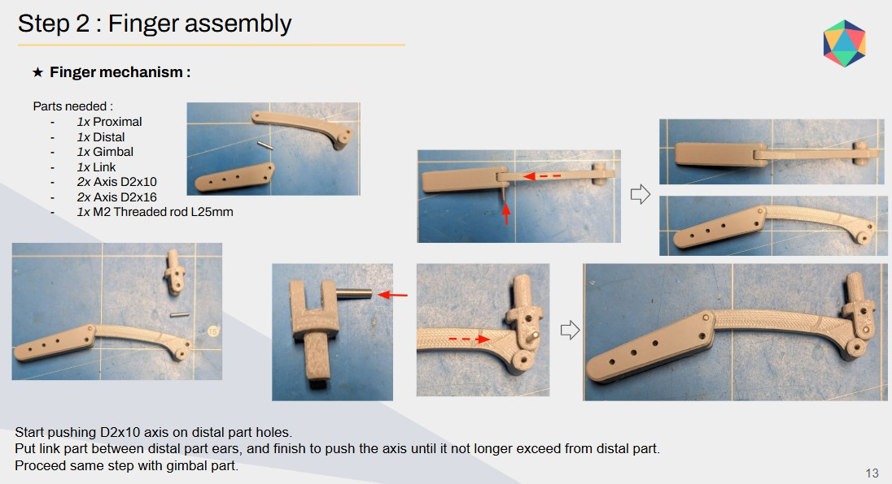

你还需要一个简单的程序/脚本为每根手指做标定，见：
- Python + Waveshare 串口总线驱动板：[这里](https://github.com/pollen-robotics/AmazingHand/tree/main/PythonExample)
- Arduino + TTLinker：[这里](https://github.com/pollen-robotics/AmazingHand/tree/main/ArduinoExample)

注意：这份组装指南针对的是独立的右手。

如果要组装独立的左手，舵机位置可以沿用相同的 ID，在软件中选择左手或右手即可。

## 运行基础演示

Python 和 Arduino 都有基础演示可用。

你需要一个外部电源，才能驱动手内的 8 个驱动器。

如果还没有，一个简单的 DC/DC 220V -> 5V / 2A 带 DC 头的适配器即可。
参见 BOM 清单：
[AmazingHand BOM](https://docs.google.com/spreadsheets/d/1QH2ePseqXjAhkWdS9oBYAcHPrxaxkSRCgM_kOK0m52E/edit?gid=1269903342#gid=1269903342)

- Python 脚本："AmazingHand_Demo.py" [在这里](https://github.com/pollen-robotics/AmazingHand/tree/main/ArduinoExample)

- Arduino 程序："AmazingHand_Demo.ino" [在这里](https://github.com/pollen-robotics/AmazingHand/tree/main/PythonExample)

https://github.com/user-attachments/assets/485fc1f4-cc57-4e59-90b5-e84518b9fed0

## 需要在同一条总线上同时使用左右手？

如果你要同时组装左右手并接到机器人上，就必须为左右手分配不同的 ID。同一条串口总线上不能存在两个相同 ID 的舵机……
非常重要的是：保持舵机的组装顺序不变，但把它们的 ID 设为与右手不同的值，如下：
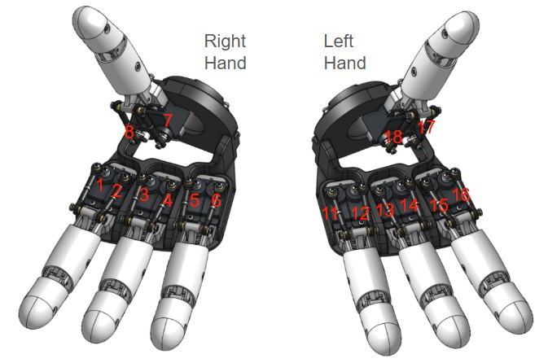

还需要专门的软件来独立驱动每只手。
这个简单的演示会让左右手同时执行相同的手势，但只有 Python 版本：
"AmazingHand_Demo_Both" [在这里](https://github.com/pollen-robotics/AmazingHand/tree/main/PythonExample)

# 免责声明

我注意到屈伸（Flexion/Extension）、收展（Abduction/Adduction）的理论角度与实机原型中的角度存在一些偏差。这大概来自多方面的误差（3D 打印件并非完美、球头连杆需逐个手动调整、舵机臂需要二次加工、塑料件的柔性……）。

该设计尚未在长时间、复杂的抓取任务中验证过。要能安全地抓取物体（即不损坏舵机或机械件），还需要构建一套更智能的软件。
SCS0009 舵机本身具备一些智能能力，例如：
- 力矩使能 / 关闭
- 力矩反馈
- 当前位置传感器
- 温度反馈
- ……
（以及更多）

# AmazingHand 进阶演示

更进阶的用法（正/逆运动学）在 [Demo](Demo) 目录下有多个示例，以及一些用于测试/配置电机的实用工具。

# 项目动态与社区
## 社区贡献

- ### Amazing Base —— 为 Amazing Hand 设计的底座：
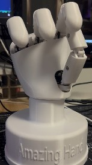
STL 或 Step 文件见[这里](https://github.com/pollen-robotics/AmazingHand/tree/main/cad)

- ### 中文版 BOM 清单：
[中文 BOM](https://docs.google.com/spreadsheets/d/1fHZiTky79vyZwICj5UGP2c_RiuLLm89K8HrB3vpb2h4/edit?gid=837395814#gid=837395814)

感谢 Jianliang Shen！

- ### 使用 SG90 舵机 + 力控方案的 Amazing hand 🔥

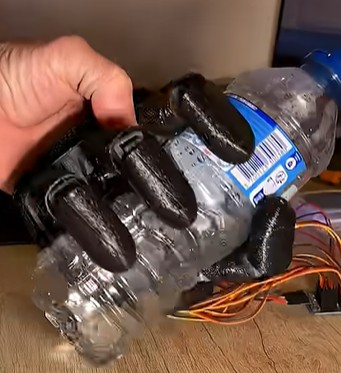
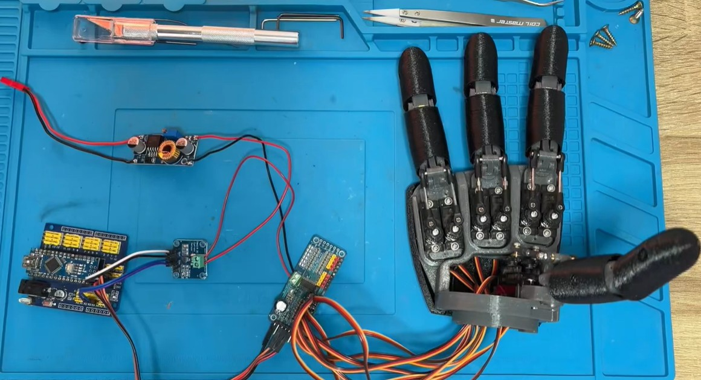

代码仓库：(https://github.com/joanbox24/AmazingHand-with-sg90-servo-force-control)

- ### 不想自己动手做？可以在这里购买套件：
https://shop.wowrobo.com/products/amazing-hand-the-open-source-robotic-hand-kit

## 待办清单
- 设计带串口集线与供电功能的小型定制 PCB，把一切塞进手内
- 用抓取任务做验证
      => 基于电机反馈，为合手动作加入更智能的行为
- 研究 4 根不同长度手指、或增加第 5 根手指的可行性
- 研究用 Feetech STS3032 电机替代 SCS0009 的可行性
      => 体积相近但力矩更强，不过舵机臂不同
- 研究用弹簧替代刚性连杆来增加柔顺性的可行性
- 加入指尖传感器，让智能控制更进一步

## 常见问题
整理中

## 联系方式

公开 Discord 频道：
[Discord AmazingHand](https://discord.com/channels/519098054377340948/1395021147346698300)

或者
[联系我或 Pollen Robotics](docs/contact.md)

## 致谢
非常感谢迄今为止为本项目做出贡献的各位：
- [Steve N'Guyen](https://github.com/SteveNguyen)：beta 测试、在 Rustypot 中集成 Feetech 电机、Mujoco/Mink 以及手势追踪演示
- [Pierre Rouanet](https://github.com/pierre-rouanet)：在 pypot 中集成 Feetech 电机
- [Augustin Crampette](https://fr.linkedin.com/in/augustin-crampette) & [Matthieu Lapeyre](https://www.linkedin.com/in/mathieulapeyre/)：开放讨论与机械方面的建议
