[English](../en/user_manual.md) | [Deutsch](../de/user_manual.md) | [Español](../es/user_manual.md) | [Français](../fr/user_manual.md) | [Italiano](../it/user_manual.md) | [日本語](../ja/user_manual.md) | 한국어 | [Português (BR)](../pt-br/user_manual.md) | [Português (PT)](../pt-pt/user_manual.md) | [简体中文](../zh-hans/user_manual.md) | [繁體中文](../zh-hant/user_manual.md)

# AmazingHand Controller – 사용자 설명서

> **버전:** 2026-03-22  
> **적용 대상:** `amazing_hand_gui.py` (GUI), `amazing_hand_cmd.py` (CLI)

---

## 1. 소개

AmazingHand Controller GUI는 Feetech SCS0009 액추에이터로 구동되는 8개 서보 로봇 손을 위한 실시간 모니터링과 수동 제어를 제공합니다. 인터페이스는 손가락 제어, 전역 관리, 텔레메트리 시각화, 활동 로깅을 위한 패널로 나뉩니다. 이 가이드는 설치, 탐색, 일반적인 워크플로를 안내합니다.

> **팁:** GUI를 조작하는 동안 이 설명서를 열어두십시오. 애플리케이션에 내장된 툴팁은 컨트롤 위에 마우스를 올리면 동일한 설명을 다시 보여줍니다.

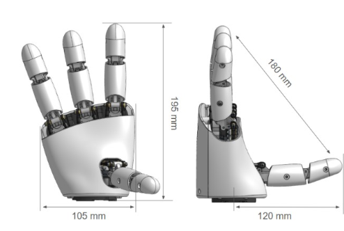

---

## 2. 빠른 시작 체크리스트

1. **의존성 설치**(환경당 한 번):
   ```bash
   python -m pip install -r requirements.txt
   ```
2. **하드웨어 전원 공급:** 5 V 전원을 서보 체인에 연결하고 USB 시리얼 어댑터를 꽂습니다.
3. **GUI 실행:**
   ```bash
   python amazing_hand_gui.py
   ```
4. **컨트롤러에 연결:** 시리얼 **Port**(예: `COM9`)를 선택하고 **▶ Connect**를 클릭합니다.
5. **텔레메트리 확인:** 차트와 피드백 테이블에서 실시간 갱신을 확인합니다.

---

## 3. 화면 개요

```
+--------------------------------------------------------------------------------+
|                              AmazingHand Controller                            |
+---------------------------+-----------------------------------------------+----+
| Finger Controls           | Chart Controls & Telemetry Plot                    |
| (Ring – Middle – Pointer) | (Display menu, chart canvas)                       |
+---------------------------+-----------------------------------------------+----+
| Control Stack             | Thumb finger   | Feedback Table (Servo Metrics)    |
| (Connection, Global, Pose,| control        | (Goal, Position, Load, etc.)      |
|  Sequence)                |                |                                   |
+---------------------------+                                                    |
| Execution Log & Status    |                                                    |
+--------------------------------------------------------------------------------+
```

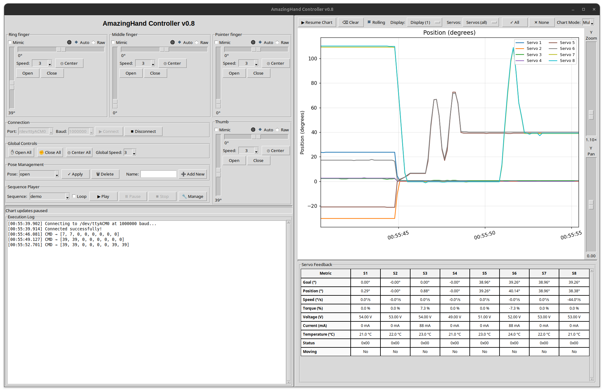

### 3.1 패널 한눈에 보기

| 패널 | 위치 | 목적 |
|-------|----------|---------|
| **Finger Controls** | 왼쪽 상단(손가락 3개) + 오른쪽 하단(엄지) | 각 손가락 쌍을 위한 개별 슬라이더와 속도 선택기. Mimic 표시기와 손가락별 상태 LED를 포함합니다. |
| **Right Control Stack** | 왼쪽, 오른쪽 하단 | 연결 설정, 전역 컨트롤, 포즈 관리, 시퀀스 플레이어. |
| **Telemetry Panel** | 오른쪽 | 확대/이동 슬라이더가 있는 실시간 차트와 설정 가능한 피드백 테이블. |
| **Execution Log** | 하단 | 상태 메시지, 경고, 시퀀스 진행 상황의 스트림. |

---

## 4. 패널 상세 가이드

### 4.1 손가락 제어 패널(왼쪽 열)

각 손가락 위젯은 한 쌍의 서보(위치 + 측방 오프셋)를 제어합니다:

- **Mode 토글:** **Auto**(base + offset 슬라이더)와 **Raw**(직접 서보 목표) 사이를 전환합니다.
- **상태 LED:** 회색(대기), 녹색(이동 중), 빨간색(차단 가능성, 부하 대 목표 기준).
- **위치 슬라이더:** 0–110°(열림 → 닫힘). 마우스 휠은 1°씩 조정하며, 드래그는 빠르게 스냅됩니다.
- **측방 슬라이더:** 측방 조정을 위한 ±40°. 엄지 측방 슬라이더는 **반전**되어 있어 물리적 방향이 손의 해부학적 방향과 일치합니다 — 오른쪽으로 드래그하면 엄지가 하드웨어 장착 기준 양의 방향으로 움직입니다.
- **속도 선택기:** 손가락 쌍의 두 서보 모두의 이동 속도를 제어하는 드롭다운 1–6.
- **Mimic 체크박스:** Auto 모드에서 소스 손가락의 닫기/열기 동작을 반영하여 협응된 움직임을 만듭니다.

**손가락 모드: Auto vs Raw**

- **Auto 모드**(기본)는 닫기/열기 슬라이더, 측방 오프셋 슬라이더, 속도 드롭다운, center 버튼을 노출합니다. GUI는 `data/hand_config.yaml`에 저장된 캘리브레이션된 극값을 사용하여 이 두 슬라이더 값을 서보 명령으로 블렌딩하므로, 수동 서보 계산 없이 손가락 쌍이 자연스러운 포즈를 따라갑니다. Mimic은 여기서 활성 상태로 유지됩니다 — 여러 손가락에서 활성화하면 현재 조정 중인 손가락과 동기화하여 구동됩니다.
- **Raw 모드**는 Auto 컨트롤을 서보별로 레이블된 두 개의 수직 슬라이더로 교체합니다. 엔드 스톱 테스트, 캘리브레이션 검증, 링크 문제 진단 시 이들을 움직여 기본 서보 각도를 직접 명령합니다. Raw는 auto-mixing 로직을 우회하므로 center 버튼과 mimic 체크박스가 비활성화됩니다; 키보드 단축키는 여전히 작동하며, 위/아래는 서보 1을, 왼쪽/오른쪽은 서보 2를 구동합니다. Raw는 마지막으로 선택한 속도 값을 사용하므로, 특정 이동 속도가 필요하면 전환 전에 속도를 설정하십시오.

**Auto 모드가 서보 목표를 계산하는 방식**

- 닫기/열기 슬라이더 값은 `limits.base_min/base_max`로 클램프된 다음, 정규화되어(`t = base / base_max`) 손가락의 각 측면에 대한 `auto_extremes` 열림 대 닫힘 포즈 사이를 보간합니다.
- 측방 오프셋 슬라이더는 `limits.side_min/side_max`로 클램프되고 블렌드 계수(`u`)로 변환됩니다. 음수 오프셋은 중앙 포즈에서 `left_open`/`left_closed` 쪽으로 lerp하고, 양수 오프셋은 오른쪽 극값 쪽으로 lerp합니다.
- 측방 오프셋이 없으면 두 서보 모두 단순히 base 슬라이더 값을 받습니다. 최종 서보 목표는 발행 전에 `limits.servo_min/servo_max`로 클램프되어, 동작이 캘리브레이션된 안전 범위 내에 유지됩니다.

키보드 단축키가 슬라이더를 보완합니다(§5.2에 문서화됨).

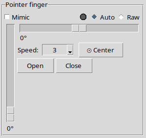

### 4.2 전역 컨트롤 스택(손가락 패널 오른쪽)

1. **Connection:** 포트와 보레이트 선택(연결 중에는 두 드롭다운 모두 비활성화), connect/disconnect 버튼. 하단의 상태 표시줄이 성공 또는 오류를 보고합니다.
2. **Global Controls:**
   - **Open All / Close All / Center All** – 모든 손가락에 즉시 적용됩니다.
   - **Global Speed 드롭다운** – 손가락별 속도 선택기를 공통 값(1–6)으로 설정합니다.
3. **Pose Management:** `data/hand_config.yaml`에 저장된 포즈를 저장, 로드, 적용, 삭제합니다.
   - 레이아웃: `Pose: [dropdown]  ✓ Apply  🗑 Delete  Name: [entry]  ➕ Add New`
   - **🗑 Delete**는 선택된 포즈를 영구적으로 제거합니다(확인 대화 상자 표시).
4. **Sequence Player:** 선택적 루핑과 함께 다단계 애니메이션을 선택하고 실행합니다. **🔧 Manage**를 통해 시퀀스 관리자 대화 상자에 접근합니다.

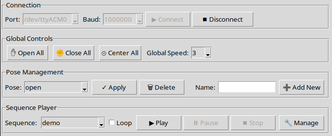

### 4.3 텔레메트리 및 피드백 패널(오른쪽 열)

- **컨트롤 행:**
  - 차트 갱신 일시정지/재개.
  - 롤링 윈도우 토글.
  - 지표 선택(위치, 부하, 속도, 온도, 전압, 이동 플래그).
  - 모드 전환(Multi-Servo vs Scope), 후자의 경우 서보 선택기 포함.
  - 「All/None/Clear」 도우미가 있는 서보 가시성 드롭다운.


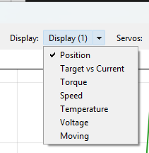

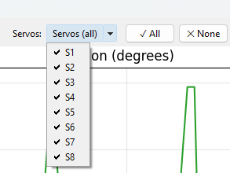

#### 차트 모드

- **Multi-Servo**(기본)는 활성화된 모든 서보 트레이스를 차트에 유지합니다. **Servos** 드롭다운을 사용하여 그룹을 빠르게 켜고 끄며 손가락 간 움직임이나 부하를 비교합니다.
- **Scope**는 **Scope Servo** 선택기를 활성화하여, 동일한 지표 체크박스를 그대로 사용하면서 단일 채널에 집중할 수 있게 합니다. 이 모드를 서보 가시성 메뉴와 결합하면(예: 모두 숨긴 후 스코프 서보만 다시 활성화) 다른 트레이스 없이 오실로스코프 스타일 뷰를 얻을 수 있습니다.
- 모드와 무관하게 텔레메트리 테이블은 모든 서보를 계속 표시하므로, 집중한 차트를 더 넓은 데이터 스냅샷과 연관지을 수 있습니다.
- **차트 영역:** 선택된 텔레메트리를 보여주는 Matplotlib 플롯. 슬라이더로 확대:
  - **Y Zoom / Pan:** 수직 스케일링과 이동.
  - **Time Zoom / Pan:** 최근 이력 또는 오래된 샘플에 집중.
- **피드백 테이블:** 각 서보의 Goal, Position, Speed, Load, Voltage, Temperature, Status, Moving 플래그를 요약한 스크롤 가능한 그리드.

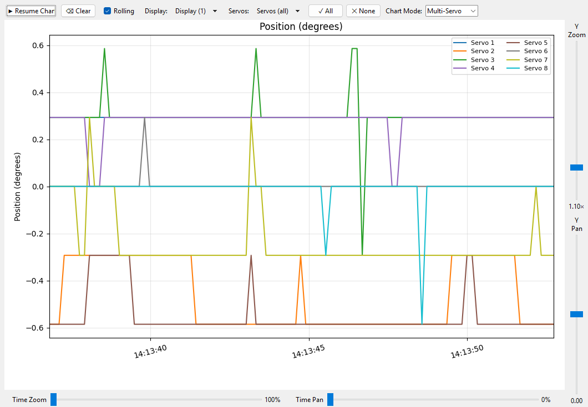

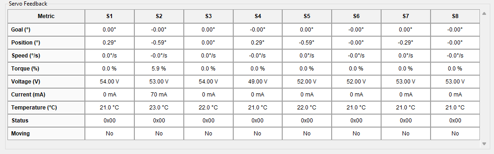

### 4.4 실행 로그 및 상태 표시줄

손가락 패널 아래에 위치하며, 로그는 작업을 시간 순서대로 기록합니다. 상태 표시줄은 최신 동작이나 경고를 표시합니다.

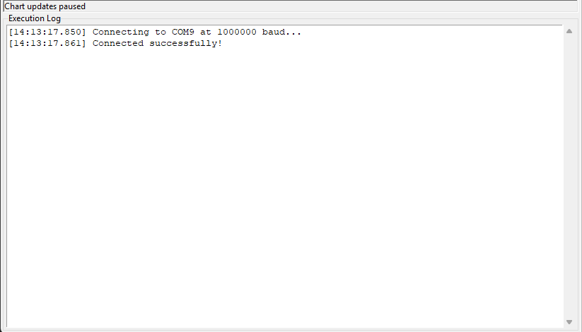

---

## 5. 손 조작

### 5.1 하드웨어 연결

1. 서보에 전원을 공급하고 USB 어댑터를 연결합니다.
2. GUI를 실행하고 올바른 **Port**가 자동 선택되는지 확인합니다(Windows에서는 `COM*`, Linux/macOS에서는 `/dev/tty*`).
3. **▶ Connect**를 클릭합니다. 성공하면 버튼 상태가 바뀌고 상태 표시줄이 갱신됩니다.
4. 연결에 실패하면 케이블, 전원, 포트 할당을 확인합니다.

### 5.2 수동 제어 및 단축키

- 키 **1–4**로 손가락을 선택합니다(1 = 약지, 2 = 중지, 3 = 검지, 4 = 엄지).
- **방향키:** 위/아래는 위치를 조정하고, 왼쪽/오른쪽은 측방 오프셋을 조정합니다.
- **Shift**를 누르고 있으면 스텝 크기가 5배, **Ctrl**은 10배가 됩니다.
- **Q / E:** 선택된 손가락을 완전히 닫기 / 열기.
- **C:** 측방 오프셋 중앙 정렬.
- 화면의 슬라이더는 키보드 입력을 실시간으로 반영합니다.

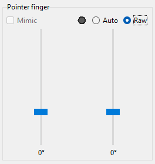

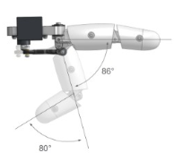

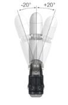

### 5.3 속도 설정

- 손가락별 속도 드롭다운(1 = 느림, 6 = 빠름)이 서보 속도를 제어합니다.
- **Global Speed** 선택기가 모든 손가락 속도를 동기화합니다.
- 동작 중 피드백 테이블(`Speed` 행)에서 속도 변화를 관찰합니다.

### 5.4 포즈 적용 및 삭제

1. 슬라이더나 키보드 단축키로 손가락 위치를 배치합니다.
2. **Pose Management**에서 고유한 이름을 입력하고 **➕ Add New**를 클릭합니다.
3. 적용하려면 드롭다운에서 포즈를 선택하고 **✓ Apply**를 클릭합니다.
4. 삭제하려면 드롭다운에서 포즈를 선택하고 **🗑 Delete**를 클릭합니다. 확인 대화 상자가 실수로 인한 제거를 방지합니다.

> 포즈는 서보 위치만 저장하며, 속도는 실행 시 GUI 설정에 의해 결정됩니다.

### 5.5 시퀀스 구성 및 실행

1. Sequence Player에서 **🔧 Manage**를 클릭합니다.
2. 대화 상자에서:
   - **Available Poses** 목록을 사용하여 스텝을 추가합니다(더블 클릭 또는 **➕ Add** 누름).
   - 스핀박스로 손가락별 속도를 조정하고, 선택적 스텝 지연을 설정합니다.
   - **⏱ Delay**를 사용하여 전용 슬립 구간을 삽입합니다.
   - ↑/↓ 버튼으로 스텝 순서를 바꿉니다.
   - 이름을 입력하고 **💾 Save Sequence**를 클릭합니다.
   - 저장하지 않고 테스트하려면 **▶ Execute**를 클릭합니다.
3. 메인 창으로 돌아와 시퀀스를 선택하고 **▶ Play**를 누릅니다. 연속 재생을 원하면 **Loop**를 활성화합니다.

> 시퀀스 정의는 `data/hand_config.yaml`의 `sequences` 키 아래에 있습니다. 루프는 YAML이 아니라 실행 시점에서 제어됩니다.

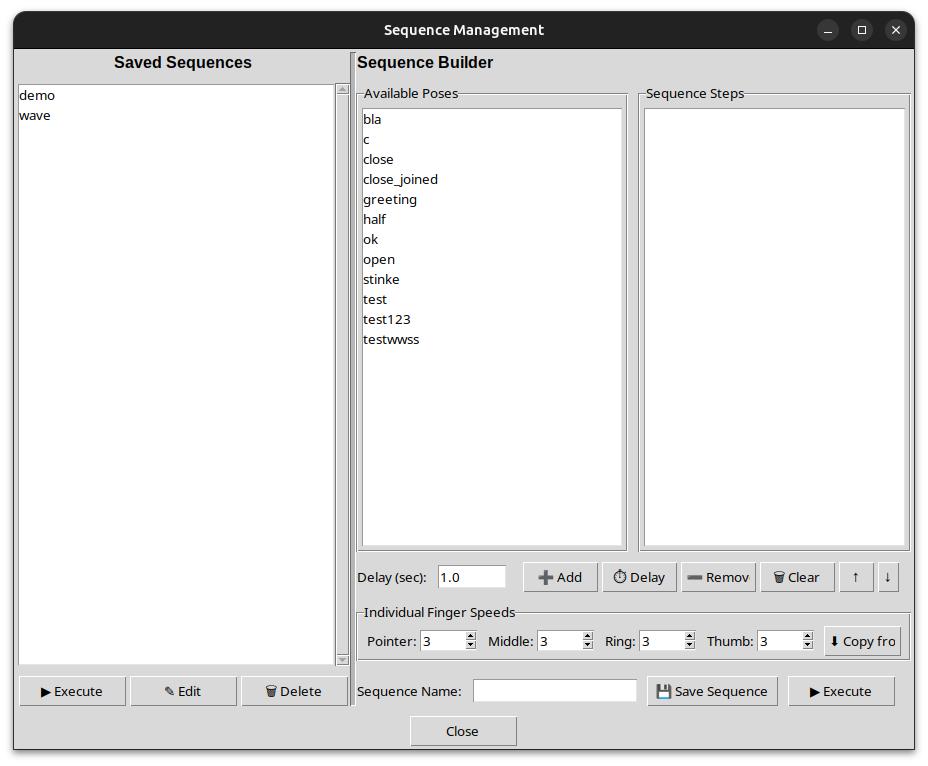

### 5.6 텔레메트리 모니터링

- 원하는 지표가 **Display** 메뉴에서 체크되어 있는지 확인합니다.
- 확대/이동 슬라이더를 사용하여 관심 구간에 집중합니다.
- 차트 요소 위에 마우스를 올려(Matplotlib 표준 상호작용) 값을 확인합니다.
- 피드백 테이블은 비동기로 갱신되며, 강조된 셀은 최근 변경을 나타냅니다.
- 차트가 복잡해지면 **⌫ Clear**를 클릭하여 수집된 데이터를 재설정합니다.

---

## 6. 명령줄 인터페이스 (`amazing_hand_cmd.py`)

CLI를 사용하면 GUI를 실행하지 않고 터미널에서 직접 포즈를 적용하고 시퀀스를 재생할 수 있습니다. 동일한 `data/hand_config.yaml` 파일을 읽습니다.

### 6.1 기본 사용법

```bash
# List all saved poses and sequences
python amazing_hand_cmd.py --list

# Apply a single pose
python amazing_hand_cmd.py --pose open
python amazing_hand_cmd.py --pose close

# Play a sequence once
python amazing_hand_cmd.py --sequence demo

# Play a sequence in a loop (Ctrl+C to stop)
python amazing_hand_cmd.py --sequence wave --loop
```

### 6.2 옵션

| 옵션 | 기본값 | 설명 |
|--------|---------|-------------|
| `--pose NAME` | – | 지정한 포즈를 적용한 후 종료 |
| `--sequence NAME` | – | 지정한 시퀀스를 재생한 후 종료 |
| `--list` | – | 모든 포즈와 시퀀스 나열 |
| `--loop` | off | Ctrl+C까지 시퀀스를 연속 루프 |
| `--port PORT` | `/dev/ttyACM0` (Linux) / `COM9` (Win) | 시리얼 포트 재정의 |
| `--baudrate N` | `1000000` | 보레이트 재정의 |
| `--config PATH` | `data/hand_config.yaml` | 대체 설정 파일의 경로 |

### 6.3 참고 사항

- 토크는 연결 시 **활성화**되고 종료 시 **비활성화**되어, 스크립트 종료 후 서보가 힘이 풀립니다.
- 스텝별 속도와 지연은 GUI 시퀀스 플레이어와 동일하게 동작합니다.
- `--loop` 플래그는 `--sequence`와 함께만 사용할 수 있습니다.

---

## 7. 문제 해결

| 증상 | 권장 조치 |
|---------|-----------------| 
| **시리얼 포트가 나열되지 않음** | USB 어댑터를 다시 꽂거나, 드라이버를 설치하거나, GUI를 재시작합니다. |
| **Connect 버튼이 회색으로 표시됨** | 이미 연결되어 있습니다; 먼저 **⏹ Disconnect**를 클릭합니다. |
| **크기 조절 중 UI가 느림** | 성능 최적화(디바운스된 크기 조절, 스로틀된 다시 그리기)가 이를 최소화하지만, 불필요한 창을 닫으면 도움이 됩니다. |
| **시퀀스가 모든 손가락을 움직이지 않음** | 스텝별 속도를 확인하고 각 포즈에 8개 서보 값이 모두 포함되어 있는지 확인합니다. |
| **차단 표시기가 계속됨** | 기계적 방해물을 점검합니다; 차단 상태는 목표와 위치가 크게 다른데 움직임이 없을 때 트리거됩니다. |

---

## 8. 부록

### 8.1 파일 구조

```
AmazingHandControl/
├── amazing_hand_gui.py          # GUI application
├── amazing_hand_cmd.py          # CLI tool
├── data/hand_config.yaml        # Poses & sequences
├── data/config.yaml             # Application settings
├── docs/<lang>/user_manual.md        # This document
├── docs/<lang>/CONFIG_FORMAT.md      # YAML config file reference
├── docs/en/screenshots/              # PNG captures embedded in this manual
├── docs/<lang>/scs_servo_protocol.md # SCS servo protocol reference
└── README.md                    # Quick reference
```

### 8.2 유용한 링크

- [AmazingHand(공식 프로젝트)](https://github.com/pollen-robotics/AmazingHand)
- [Feetech Servo Debug Tool](https://github.com/Robot-Maker-SAS/FeetechServo/tree/main/feetech%20debug%20tool%20master/FD1.9.8.2)
- [서보 식별 튜토리얼](https://www.robot-maker.com/forum/tutorials/article/168-brancher-et-controler-le-servomoteur-feetech-sts3032-360/)

---

## 9. 개정 이력

| 날짜 | 작성자 | 비고 |
|------|--------|-------|
| 2026-03-22 | Ingo | CLI(`amazing_hand_cmd.py`) 섹션 추가; 설명서 버전 갱신. |
| 2026-03-21 | Ingo | 패널 레이아웃 갱신: 약지/검지 순서 교체, 엄지를 오른쪽으로 이동, 컨트롤 스택을 왼쪽으로 이동. 엄지 측방 슬라이더 반전. Apply와 Name 사이에 포즈 삭제 버튼 추가. 연결 중에는 포트와 보레이트 드롭다운이 잠기도록 변경. 키보드 단축키 1–4가 이제 약지/중지/검지/엄지에 매핑됨. |
| 2025-11-25 | Ingo | 확장된 스크린샷 갤러리, 차트 모드 설명, 새로 고친 패널 안내를 추가. |
| 2025-11-25 | Ingo | UI 패널, 워크플로, 텔레메트리 사용법을 다룬 최초 설명서. |
