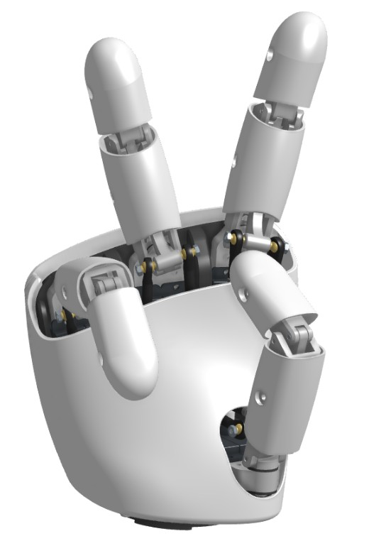

[English](README.md) | 简体中文

# AmazingHand

AmazingHand 是一款开源、可 3D 打印的仿生人形机械手，**4 根手指、8 个自由度**。所有驱动都内置在手掌之内——无需向前臂引出线缆——整手约 400 g，零件成本低于 €200。

本仓库汇集了 [Pollen Robotics](https://github.com/pollen-robotics/AmazingHand) 原项目的机械设计与固件，以及钜犀科技（Juxi Technology）开发的控制软件与舵机工具。

## 📦 仓库内容

| 文件夹 | 说明 | README |
|--------|------|--------|
| **`AmazingHand-main/`** | 原版设计：STL/STEP CAD 文件、Arduino 与 Python 示例、演示程序（控制、仿真、手势追踪）、组装与 3D 打印指南、BOM 清单 | [English](AmazingHand-main/README.md) · [简体中文](AmazingHand-main/README_CN.md) |
| **`AmazingHandControl/`** | Python 控制工具：Tkinter 图形界面与命令行工具，支持标定、手势预设、序列与实时舵机控制 | [English](AmazingHandControl/README.md) · [简体中文](AmazingHandControl/README_CN.md) |
| **`SCS0009_ServoController/`** | SCS0009 舵机调试工具：PySide6 图形界面，可扫描总线、读写全部 44 个寄存器、修改波特率、恢复出厂设置，并以 `.xdat` 备份参数 | [English](SCS0009_ServoController/README.md) · [简体中文](SCS0009_ServoController/README_CN.md) |

## 🔧 硬件

- 8 个 Feetech **SCS0009** 舵机（电位器反馈，10 位分辨率，0–1023）
- 外部 5 V / 2 A 电源
- 串口总线驱动板，或 Arduino + Feetech TTL Linker
- 3D 打印件——见 [BOM 清单](AmazingHand-main/README.md#bom-bill-of-materials)

每根手指由一个并联机构驱动：两个 SCS0009 舵机分别控制其屈伸（flexion/extension）与收展（abduction/adduction）。

## 📖 文档

- [组装指南](AmazingHand-main/docs/AmazingHand_Assembly.pdf)
- [3D 打印建议](AmazingHand-main/docs/AmazingHand_3DprintingTips.pdf)
- [AmazingHand 概览](AmazingHand-main/docs/AmazingHand_Overview.pdf)
- [中文 BOM 清单](https://docs.google.com/spreadsheets/d/1fHZiTky79vyZwICj5UGP2c_RiuLLm89K8HrB3vpb2h4/edit?gid=837395814#gid=837395814)

## 📄 许可与署名

- 软件：[Apache License 2.0](AmazingHand-main/LICENSE)
- 机械设计：[CC BY 4.0](https://creativecommons.org/licenses/by/4.0/)
- `SCS0009_ServoController/`：[MIT](SCS0009_ServoController/LICENSE)

基于 Pollen Robotics 的 [AmazingHand](https://github.com/pollen-robotics/AmazingHand) 项目。
